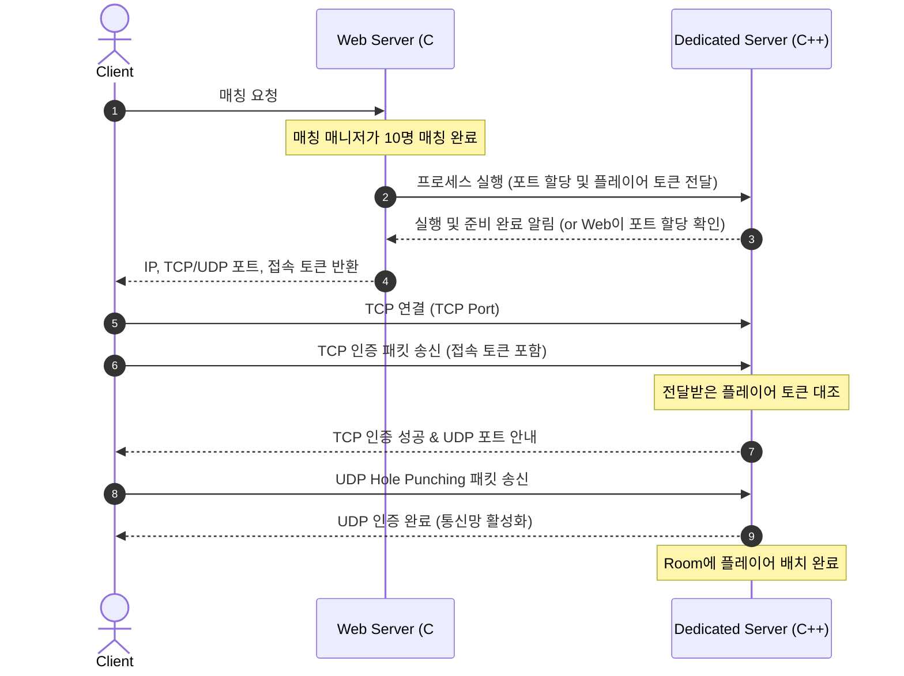

# Dedicated Server Architecture Migration Plan

본 문서는 C# Web Server(AuthServer)로 매칭 및 룸 생성을 이관하고, C++ 로직 서버를 **1룸 1프로세스(Room-per-Process) 기반 Dedicated Server** 모델로 전환하기 위한 상세 아키텍처 설계와 구현 가이드라인을 제공합니다.

---

## 1. 아키텍처 변경 개요 (Before vs After)

```mermaid
graph TD
    subgraph [기존 아키텍처 (Multi-Room In-Process)]
        Client1[Client] -->|TCP Connect| CxxServer[C++ Logic Server]
        Client1 -->|Request Matchmaking| CxxServer
        CxxServer -->|TryMatch & Create Room| RoomMap[Room Map]
    end

    subgraph [신규 아키텍처 (Dedicated Room-per-Process)]
        Client2[Client] -->|1. Request Match| WebServer[C# Web Server]
        WebServer -->|2. Match Success| WebServer
        WebServer -->|3. Spawn Process| DedicServer[C++ Dedicated Server]
        WebServer -->|4. Connection Info (IP/Port/Token)| Client2
        Client2 -->|5. Connect via TCP/UDP| DedicServer
    end
```

### 핵심 변경 사항 비교

| 기능 영역 | 기존 아키텍처 (Multi-Room) | 변경 아키텍처 (Dedicated Room-per-Process) |
| :--- | :--- | :--- |
| **매칭 (Matchmaking)** | C++ 서버 내 `Matching` 클래스에서 대기열 관리 | **Web Server(C#)**에서 전체 유저 매칭 및 매칭 풀 관리 |
| **서버/룸 라이프사이클** | 단일 C++ 서버 프로세스 내 동적 Room 생성/소멸 | **Web Server(C#)**가 C++ 프로세스를 실행하고 종료 감지 |
| **클라이언트 접속 정보** | 고정 포트로 TCP 접속 후 방 ID 할당 받음 | 매칭 성공 시 Web Server로부터 **고유 포트 및 토큰**을 발급받아 접속 |
| **방(Room) 관리** | `Listener` 내 `std::unordered_map<uuid, Room>` 관리 | 프로세스 당 **단 1개의 단일 Room**만 생성 및 로딩 |
| **인증 (Authentication)** | 서버 자체 발급 Session ID 기반 | Web Server가 발급한 **Match Session Token** 대조 검증 |

---

## 2. 세부 컴포넌트 설계

### A. Web Server (C#) 역할 및 흐름
1. **매칭 완료**: 매칭이 성공하면 고유한 `MatchId`와 참가할 플레이어 목록을 생성합니다.
2. **포트 할당 및 프로세스 실행**:
   * 사용 가능한 TCP 포트와 UDP 포트를 동적으로 할당합니다 (예: Port Pool 관리 또는 OS 자동 할당 포트 감지).
   * C++ Dedicated Server 프로세스를 명령줄 인자(CLI arguments)를 전달하여 실행합니다.
     ```bash
     ./LogicServer --match-id <match_uuid> --tcp-port <port> --udp-port <port> --players <player_uuid_1>,<player_uuid_2>
     ```
3. **접속 정보 전달**: 매칭된 클라이언트들에게 `{ ServerIP, TCPPort, UDPPort, PlayerToken }` 형태로 접속 정보를 전달합니다.

---

### B. C++ Dedicated Server (Logic Server) 설계 변경

Dedicated Server는 구동 시 인자를 읽어 **단 하나의 룸**만 관리하며, 매치가 종료되거나 플레이어가 모두 나가면 스스로 종료됩니다.

#### 1. CLI 파라미터 파싱 및 메인 진입점 (`main.cpp`)
서버 시작 시 전달받은 인수들을 파싱하여 설정 구조체(`ServerConfig`)를 초기화합니다.
* 불필요해진 `Matching` 객체 생성 코드를 제거합니다.
* 지정된 포트로 `Listener`를 바인딩하고, 단 하나의 `Room` 객체를 미리 생성해 둡니다.

```cpp
// main.cpp 변경 가이드
int main(int argc, char* argv[]) {
    // 1. CLI Arguments 파싱
    ServerConfig config = ParseArguments(argc, argv);
    
    // 2. IOManager, SessionManager 초기화 (기존 동일)
    const auto ioManager = IOManager::Create("io_manager", threadCount, blockingThreadCount);
    const auto sessionManager = SessionManager::Create();
    
    // 3. Matching 제거 및 전용 Listener 생성
    // port 번호는 config.tcpPort 사용
    const auto listener = Listener::Create(ioManager, sessionManager, config);
    
    // 4. 단일 Room 선제적 생성 및 Listener에 등록
    const auto mainRoom = Room::Create(ioManager, sessionManager, config.matchId);
    listener->SetDedicatedRoom(mainRoom);
    
    listener->Start();
    
    // 5. 프로세스 수명 관리 루프
    // (예: 모든 플레이어가 나가거나 게임이 끝난 경우 종료)
    WaitForShutdownCondition(listener);
    
    listener->Stop();
    return 0;
}
```

#### 2. `Listener` 수정 사항 (`Listener.hpp` & `Listener.cpp`)
* **다중 룸 맵 제거**: `std::unordered_map<uuids::uuid, std::shared_ptr<Room>> _rooms;`를 단일 `std::shared_ptr<Room> _dedicatedRoom;`으로 단순화합니다.
* **매칭 큐 제거**: `_matching` 포인터 및 `AddToMatchmakingQueue()`를 완전히 제거합니다.
* **패킷 라우팅 단순화**: UDP 인게임 패킷 수신 시, Room ID 비교 없이 바로 `_dedicatedRoom->EnqueuePacket()`으로 라우팅할 수 있어 처리 효율이 극대화됩니다.

#### 3. `Session` 수정 및 플레이어 인증 (`Session.cpp`)
* **매칭 요청 핸들러 제거**: TCP 수신 패킷 처리 루프(`ProcessPacketAsync()`)에서 `PacketType::Match` 분기 처리를 제거합니다.
* **Web Token 검증**:
  * TCP 연결 직후 클라이언트가 보낸 인증 토큰을 검증합니다.
  * 해당 토큰(또는 플레이어 UUID)이 시작 시 `--players` 목록에 있는지 대조합니다.
  * 인증 성공 시 즉시 `_dedicatedRoom->AddSession(sessionId, shared_from_this())`를 호출하여 세션을 Room에 등록합니다.
  * 이후 바로 UDP 포트 정보를 클라이언트에 전송하여 UDP Hole Punching 단계로 넘어갑니다.

#### 4. Dedicated Server 수명 관리 (Self-Shutdown)
1. **클라이언트 미접속 대기 (Timeout)**: 서버 실행 후 일정 시간(예: 60초) 동안 플레이어가 아무도 접속하지 않으면 서버가 자동 종료됩니다.
2. **게임 종료**: Room 내의 World 시뮬레이션이 종료 판정을 내리면(예: 승패 결정), 웹 서버에 결과를 전송(Webhook)하고 프로세스를 스스로 종료합니다.
3. **유저 없음**: 모든 세션이 연결을 유실하고 Room이 비었을 때(Session Count == 0), 일정 유예 시간을 거쳐 종료 프로세스를 밟습니다.

---

## 3. 통신 및 핸드셰이크 시나리오 (Sequence Diagram)



---

## 4. 단계별 이행 가이드 (Implementation Steps)

### [Phase 1] CLI 파싱 및 독립 포트 구동
* [ ] C++ 서버에 `CLI Argument Parser` 기능을 추가하여 TCP 포트, UDP 포트, Match ID, 허용 플레이어 목록을 인자로 받을 수 있도록 구현합니다.
* [ ] `main.cpp`에서 하드코딩된 `SERVER_PORT(52800)` 대신 입력받은 포트를 사용하도록 수정합니다.

### [Phase 2] 불필요한 레거시 코드 제거 및 단일 룸 바인딩
* [ ] C++ 서버의 `Matching` 클래스 연동을 중단하고 빌드 타겟 및 빌드 구성에서 정리합니다.
* [ ] `Listener`에서 `std::unordered_map`으로 룸들을 관리하던 부분을 단일 `_dedicatedRoom` 참조로 변경합니다.

### [Phase 3] 세션 인증 방식 변경
* [ ] 클라이언트가 TCP로 서버 접속 직후 검증 패킷을 보내도록 클라이언트-서버 프로토콜을 보완합니다.
* [ ] 검증 성공 시 세션을 `_dedicatedRoom`에 바로 할당하여 플레이어로 편입시킵니다.

### [Phase 4] 자동 종료(Self-Shutdown) 구현
* [ ] `Room`이 완전히 비었을 때 또는 게임 오버 시 `main` 함수 측 루프에 종료 신호를 전달해 프로세스가 안전하게 리소스를 반환하고 종료(`exit(0)`)되도록 유도합니다.

### [Phase 5] Web Server (C#) 연동 구현
* [ ] C# Web Server에서 `System.Diagnostics.Process` 등을 이용해 C++ 서버 실행 파일을 실행하고 수명을 추적하는 인프라 코드를 작성합니다.
* [ ] 클라이언트에게 매치 결과를 수신받는 Webhook 인터페이스를 Web Server에 추가합니다.

---

> [!IMPORTANT]
> **보안 고려사항**: Dedicated Server의 TCP/UDP 포트가 외부에 노출되므로, 허가되지 않은 사용자가 접속을 시도하는 공격을 막기 위해 Web Server가 발급한 dynamic token에 대한 검증 로직은 반드시 암호화/대조 처리가 철저히 되어야 합니다.
